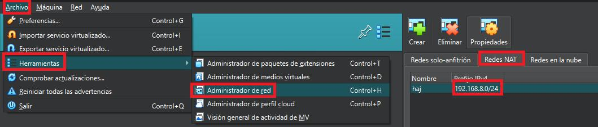
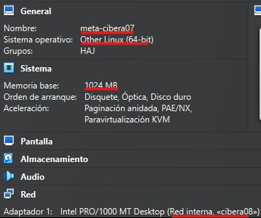
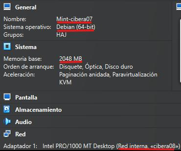
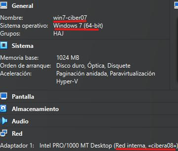
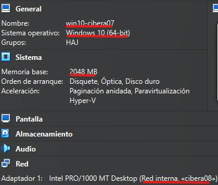
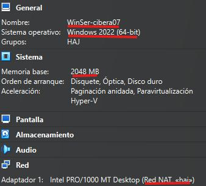

# Configuración de un laboratorio Virtualn de contención y comandos en ciberseguridad(I)
## Objetivo 

En esta práctica a grandes rasgo se preparará un laboratorio virtual con diferentes máquina preparadas dentro de una red conectada entre ellas.

## Indice

1. [Requisitos](#requisitos)
2. [Preparación del entorno para el uso de la Red Nat](#preparación-el-entorno-para-uso-de-la-red-nat)
3. [Preparación de las máquinas Virtuales](#creación-de-la-máquinas-virtuales-creación-de-la-máquinas-virtuales)
    - [Creación Kali Linux](#creación-kali-linux)

## Requisitos 

Para la realización de esta práctica necesitaremos de algún programa de virtualización **VBOX/VMWare** y a continuación presento las máquina que necesitaremos:

| S.O            |  Versión              |  Nombre         |  Ip                    |
|----------------|-----------------------|-----------------|------------------------|
| Kali linux     | 2024.3                | Kali-Cibera08   | 192.168.8.6 / 10.0.8.1 |
| Metasploitable | 2.0.0                 | Meta-Cibera08   | 10.0.8.2               |
| Linux Mint     | 22-cinnamon           | Mint-Cibera08   | 10.0.8.3               | 
| Windows        | Windows 7 enterprise  | Win7-Cibera08   | 10.0.8.4               |
| Windows        | Windows 10 enterprise | Win10-Cibera08  | 10.0.8.5               |
| Windows        | Windows server 2022   | WinSer-Cibera08 | 10.0.8.6               |

## Preparación el entorno para uso de la Red Nat 

Antes de crear las diferentes máquinas virtuales crearemos una red nat para
ello nos dirigiremos a **Archivo->Herramientas->Administrador de red->Red Nat**
en la versión 7.1.4 de Virtualbox, la dirección ip que asignaremos en mi caso será
**192.168.8.X**.

## Creación de la máquinas Virtuales Creación de la máquinas Virtuales
En este apartado prepararemos y crearemos las diferentes máquinas virtuales
que necesitaremos. 
### Creación Kali Linux
Para la creación de esta máquina en mi caso le pondremos como nombre **kali-cibera07** con una memoria RAM de **3075 MB** con **2** procesadores dentro de la distribución **Debian** y lo meteremos dentro de nuestra red nat en mi caso denominada **haj** y dentro de nuestra red interna denominada **cibera08**.

### Creación Metasploitable
Para la creación de esta máquina en mi caso le pondremos como nombre0
**meta-cibera07** con una memoria RAM de **1024 MB** con **1** procesador dentro
de la distribución **Other Linux** y lo meteremos dentro de nuestra red Nat en mi caso denominada haj

### Creación Linux Mint
Para la creación de esta máquina en mi caso le pondremos como nombre
“Mint-cibera07” con una memoria RAM de “2048 MB” con “1” procesador dentro
de la distribución “Debian” y lo meteremos dentro de nuestra red Nat en mi caso
denominada haj.

### Creación Windows 7
Para la creación de esta máquina en mi caso le pondremos como nombre0
“win7-cibera07” con una memoria RAM de “1024 MB” con “1” procesador y lo
meteremos dentro de nuestra red Nat en mi caso denominada haj

### Creación Windows 10
Para la creación de esta máquina en mi caso le pondremos como nombre0
“kali_linux_cibera07” con una memoria RAM de “3075 MB” con “2” procesadores
y lo meteremos dentro de nuestra red Nat en mi caso denominada haj.

### Creación Windows Server
Para la creación de esta máquina en mi caso le pondremos como nombre0
“kali_linux_cibera07” con una memoria RAM de “3075 MB” con “2” procesadores
y lo meteremos dentro de nuestra red Nat en mi caso denominada haj

### Configuración de Máquinas Virtuales 
### Comunicación entre las diferentes máquinas 
### Configurar ip forwarding 
### Configurar la interfaz de red interna
### Configurar NAT con iptables 
### Comprobación de la conectividad 
## Instalar Mozilla Developer 
## Configurar Apache Kali Linux 
## Configurar Teclado metasploitable 
## Realizar la configuración modo monitor 
## Conclusión 

