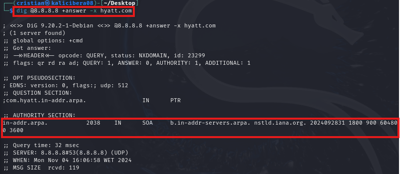
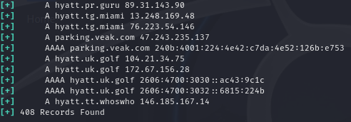
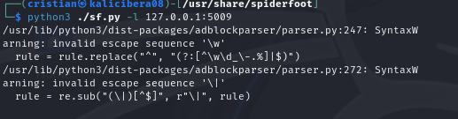

# Práctica: Test Intrusión, enumeración de vulnerabilidadess y comandos en cibersguridad(II)
**Objetivo** 

En esta práctica desarrollaremos los test de intrusión o pentest para evaluar la seguridad de un sistema o red simulando el ataque por un intruso. Se realiza para comprobar cuál es el impacto real de una vulnerabilidad mediante la realización de pruebas controladas y se busca la detección de vulnerabilidades no conocidas. Con ello, conseguimos obtener el estado global de seguridad de un sistema.

## Indice

- [Requisitos](#requisitos)
- [Preparación del entorno para el uso de la Red Nat](#preparación-el-entorno-para-uso-de-la-red-nat)
- [Preparación de las máquinas Virtuales](#creación-de-la-máquinas-virtuales-creación-de-la-máquinas-virtuales)
    - [Creación Kali Linux](#creación-kali-linux)

## Requisitos 

Para la realización de esta práctica necesitaremos de algún programa de virtualización **VBOX/VMWare** y a continuación presento las máquina que necesitaremos:

| S.O            |  Versión              |  Nombre         |  Ip                    |
|----------------|-----------------------|-----------------|------------------------|
| Kali linux     | 2024.3                | Kali-Cibera08   | 192.168.8.6 / 10.0.8.1 |
| Windows        | Windows 10 enterprise | Win10-Cibera08  | 10.0.8.5               |
| Windows        | Windows server 2022   | WinSer-Cibera08 | 10.0.8.6               |

### **Comando who y w**

Muestra quién ha iniciado sesión en el sistema, aunque **w** muestra más información, como el lugar desde el que iniciaron sesión y cuanto tiempo han estado inactivos.

### **Comando last**

Este comando muestra los inicios de sesión recientes de los usuarios y, a menudo, es útil cuando se intenta rastrar cambios u otra actividad.

### **Comando whois**

Actúa sobre una lista de registro que contiene detalles sobre la propiedad de los dominios y los propietarios. 

En este caso obtendremos los detalles del dominio **hyatt.com** la cuál es un dominio de una empresa internacional de hoteles.

### **Comando Dig**

Sirve para preguntar a los servidores DNS, solucionar problemas gracias a su flexibiliad, facilidad de uso y claridad en la presentación de  la información.

Si lo realizamos sobre **Hyatt.com**.

Nos aparecerá los registros del dns y si realizamos un whois sobre uno de los registro **A** nos mostrará lo siguiente.

Podemos hacer mas pruebas con el comando dig
- Por ejemplo, con el que se muestra a continuación envía DNS al nombre del servidor de google(8.8.8.8)

- Una búsqueda inversa de dns que permite buscar el dominio.

### **Automatización de Whois**

Para usar whois en un script, supongamos que tenemos un conjunto de dominios para los cuales necsitamos verificar las fechas de vencimientos. Crearemos un nuevo fichero **get-expiry.sh** y con el comando **chmod**, haremos que el script sea ejecutable.

Y el script contendrá el siguiente contenido

### **Utilidad de dnsrecn y netname**

En este apartado conoceremos la utilidad de dnsrecon y netname completando la fase de enumeración. Como alternativa para saber si los dominios pertenecen a la misma organización o en cambio pertencen a otra, emplearemos DNSRECON para mostra las distintas IPs de todos los dominios que encuentra.

 

Al ser de los dominios de un a hotelera internacional tiene 408 dominios. 

Otra manera de buscar información relevenate es comprobrar el direccionamiento IP para saber si las IPs están registrada a nombre del dominio o hay un proveedor de servicios intermedios. Nos dirigiremos a [www.ripe.net](www.ripe.net) o en su defecto **whois -h whois.ripe.net DirecciónIP**

 

Para saber si un dominios web tiene DNSSEC, tenemos varios recursos OSINT en internet que lo permiten como:

- [DNSECC-Analyzer](https://dnssec-analyzer.verisignlabs.com)

- [DNS-VIZ](https://dnsviz.net/)

### **Comando host**

Para continuar haciendo nuestra identificación de activos de una organización o entorno, es importanta cómo funciona los dns. Para hacer consultas de registro DNS el comando **host**.

Emplearemos un whois, host o dig para obtener rango de direccionamiento y el netname al que pertenece.

Una vez hecho esto, obtendremos todos los rangos de direcciones ip asociados a ese NETNAME.

Y por último en este apartado, a cualquier ranago obtenido realizaremos una búsqueada PTR.

Sobre el dominio elegido, descubrir su IP con host y luego comprobrar con **whois**.

### Spiderfoot

Usaremos **spiderfoot**, abriremos un explorador y lanzaremos un escaneo sobre el dominio.

